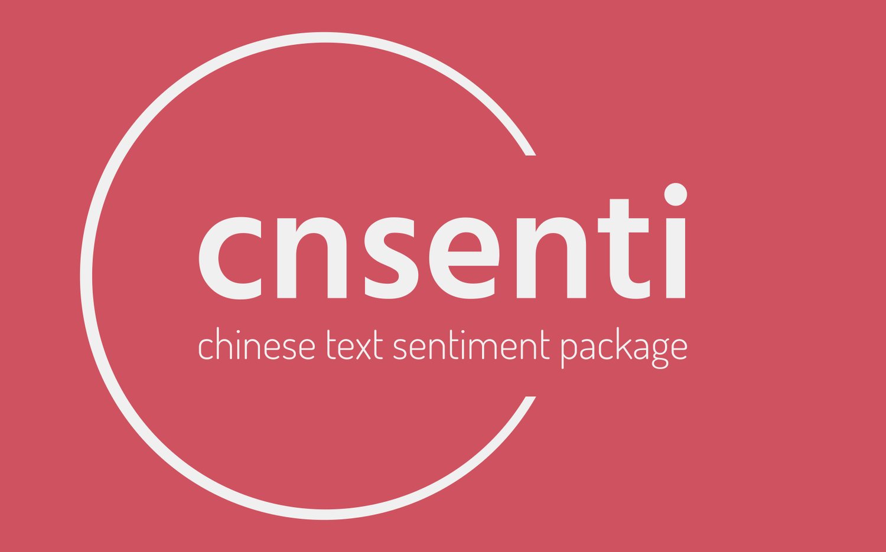

Now **cnsenti** has been integrated into **[cntext](https://github.com/hiDaDeng/cntext/)**, welcome to star!



# cnsenti

[中文文档](chinese_readme.md)

The cnsenti library can perform sentiment analysis emotion analysis on chinese texts.


### Features

- default sentiment dictionary is Hownet
- default emotion dicitonary is DLUT emotion dictionary, support 7 category emotion,such as happy/sad/hate...etc/
- support importing custom txt sentiment dictionaries (pos and neg)


### Notes

The emotional ontology library of Dalian University of Technology used for sentiment analysis in the code. If you publish a paper, please pay attention to the user license agreement

1. The emotional vocabulary ontology is independently organized and marked by the Information Retrieval Laboratory of Dalian University of Technology, and can be used by universities, research institutes and individuals at home and abroad for academic research purposes.
2. If any institute or individual needs to use it for commercial purposes, please send an email to irlab@dlut.edu.cn for negotiation.
3. If you find any errors or improprieties in this resource during use, users are welcome to send your valuable comments to the mailbox irlab@dlut.edu.cn, and we will solve them as quickly as possible.
4. If users use this resource to publish papers or obtain scientific research results, please add words such as **"using the emotional vocabulary ontology of the Information Retrieval Laboratory of Dalian University of Technology"** to the paper to declare.
5. Add the citation "徐琳宏,林鸿飞,潘宇,等.情感词汇本体的构造[J]. 情报学报, 2008, 27(2): 180-185."
6. Any user who obtains the resource through copying or other informal downloads should also abide by the license agreement. The Information Retrieval Laboratory of Dalian University of Technology has the final right to interpret and modify the license agreement.


### Installation

#### method 1

```
pip install cnsenti
```

#### method 2

```
pip install cnsenti -i https://pypi.tuna.tsinghua.edu.cn/simple/
```


<br>


# Quick Start

Count the number of positive and negative emotional words in Chinese text

```python
from cnsenti import Sentiment

senti = Sentiment()
test_text= '我好开心啊，非常非常非常高兴！今天我得了一百分，我很兴奋开心，愉快，开心'
result = senti.sentiment_count(test_text)
print(result)
```

Run

```
{'words': 24, 
'sentences': 2, 
'pos': 4, 
'neg': 0}
```


Count the number of words with different emotions in Chinese text

```python
from cnsenti import Emotion

emotion = Emotion()
test_text = '我好开心啊，非常非常非常高兴！今天我得了一百分，我很兴奋开心，愉快，开心'
result = emotion.emotion_count(test_text)
print(result)
```

Run

```
{'words': 22, 
'sentences': 2, 
'好': 0, 
'乐': 4, 
'哀': 0, 
'怒': 0, 
'惧': 0, 
'恶': 0, 
'惊': 0}
```

<br>

#  Documents

cnsenti includes two class type: **Emotion** class and **Sentiment** class

- **Emotion** class include **emotion_count(text)** method
- **Sentiment** class includes method, such as **sentiment_count(text) ** and **sentiment_calculate(text) **


### 3.1 emotion_count(text)

emotion_count(text) is used to count the number of words that appear in various emotional adjectives in the text. Use Dalian University of Technology Emotion Ontology Database Dictionary to support **7 emotion statistics (好good, 乐happy, 哀sad, 怒angry, 惧fear, 恶disgust, 惊shock)**

```python
from cnsenti import Emotion

emotion = Emotion()
test_text = '我好开心啊，非常非常非常高兴！今天我得了一百分，我很兴奋开心，愉快，开心'
result = emotion.emotion_count(test_text)
print(result)
```

Run

```
{'words': 22, 
'sentences': 2, 
'好': 0, 
'乐': 4, 
'哀': 0, 
'怒': 0, 
'惧': 0, 
'恶': 0, 
'惊': 0}
```

detail

- **words** ：the words number of the chinese text
- **sentences**： the sentence number of the chinese text
- **好good, 乐happy, 哀sad, 怒angry, 惧fear, 恶disgust, 惊shock**  the words number of different emotion


### 3.2 sentiment_count(text)

隶属于Sentiment类，可对文本text中的正、负面词进行统计。默认使用Hownet词典，后面会讲到如何导入自定义正、负情感txt词典文件。这里以默认hownet词典进行统计。

**sentiment_count(text)** belongs to the **Sentiment** class and can count the positive and negative words number of  the chinese text. The **Hownet dictionary** is used by default, and **Sentiment class** support custom positive and negative emotion dictionary txt files.

Here we use the default hownet dictionary to count the word number of chinese text.

```python
from cnsenti import Sentiment

senti = Sentiment()
test_text = '我好开心啊，非常非常非常高兴！今天我得了一百分，我很兴奋开心，愉快，开心'
result = senti.sentiment_count(test_text)
print(result)
```

Run

```
{'words': 24, 
'sentences': 2, 
'pos': 4, 
'neg': 0}
```

Detail

- **words** ：the words number of the chinese text
- **sentences**： the sentence number of the chinese text

- **pos**: the positive  words number of text chinese text
- **neg**: the positive  words number of text chinese text


### 3.3 sentiment_calculate(text)

隶属于Sentiment类，可更加精准的计算文本的情感信息。相比于sentiment_count只统计文本正负情感词个数，sentiment_calculate还考虑了

**sentiment_calculate(text)** belongs to the **Sentiment** class, which can calculate the emotional information of the chinese text more accurately. Compared with sentiment_count only counts the number of positive and negative sentiment words in the text, sentiment_calculate also considers

- Is there a modifier of strength adverbs before emotional words
- Is there an emotional semantic reversal effect of negative words before emotional words?

for examples:

```python
from cnsenti import Sentiment

senti = Sentiment()
test_text = '我好开心啊，非常非常非常高兴！今天我得了一百分，我很兴奋开心，愉快，开心'
result1 = senti.sentiment_count(test_text)
result2 = senti.sentiment_calculate(test_text)
print('sentiment_count',result1)
print('sentiment_calculate',result2)
```

Run

```
sentiment_count 
{'words': 22, 
'sentences': 2, 
'pos': 4, 
'neg': 0}

sentiment_calculate 
{'sentences': 2, 
'words': 22, 
'pos': 27.0, 
'neg': 0.0}
```


### 3.4 custom dictionary

Let's first look at the sentence that contains emotional information but without emotional adjectives

```python
from cnsenti import Sentiment
senti = Sentiment()      #两txt均为utf-8编码
test_text = '这家公司是行业的引领者，是中流砥柱。'
result1 = senti.sentiment_count(test_text)
result2 = senti.sentiment_calculate(test_text)
print('sentiment_count',result1)
print('sentiment_calculate',result2)
```

Run

```
sentiment_count {'words': 10, 'sentences': 1, 'pos': 0, 'neg': 0}
sentiment_calculate {'sentences': 1, 'words': 10, 'pos': 0, 'neg': 0}
```

As expected, although the sentence is positive, because cnsenti's own sentiment dictionary(Hownet) is only an adjective sentiment dictionary, for many scenarios, the applicability is limited, so pos=0.

#### 3.4.1 the format of custom dictionary

cnsenti supports importing custom dictionaries, but currently **only Sentiment supports importing custom positive and negative emotion dictionaries**, custom dictionaries need to meet

- Must be a txt file
- In principle, encoding is recommended to be utf-8
- only one word per line in txt file

#### 3.4.2 Sentiment custom dictionary parameters

```python
senti = Sentiment(pos='正面词自定义.txt',  
                  neg='负面词自定义.txt', 
                  merge=True,  
                  encoding='utf-8')
```

- **pos** Positive sentiment dictionary txt file path
- **neg** Negative sentiment dictionary txt file path
- **merge** Boolean；merge=True, cnsenti will merge the custom dictionary with cnsenti's own dictionary; merge=False, cnsenti will only use the custom dictionary
- **encoding** Both **pos** and **neg** txt are utf-8 encoding

#### 3.4.3 Custom dictionary use case

I put this part in the test folder, the code and the custom dictionary are in the test, so I use the relative path to set the path of the custom dictionary

```terminal
|test
   |---代码.py           #code
   |---正面词自定义.txt   #pos custom dictionary txt
   |---负面词自定义.txt   #neg custom dictionary txt
```

**正面词自定义.txt**    pos custom dictionary txt

```
中流砥柱
引领者
```


```python
from cnsenti import Sentiment

senti = Sentiment(pos='正面词自定义.txt',  #正面词典txt文件相对路径
                  neg='负面词自定义.txt',  #负面词典txt文件相对路径
                  merge=True,             #融合cnsenti自带词典和用户导入的自定义词典
                  encoding='utf-8')      #两txt均为utf-8编码

test_text = '这家公司是行业的引领者，是中流砥柱。今年的业绩非常好。'
result1 = senti.sentiment_count(test_text)
result2 = senti.sentiment_calculate(test_text)
print('sentiment_count',result1)
print('sentiment_calculate',result2)
```

Run

```
sentiment_count {'words': 16, 'sentences': 2, 'pos': 2, 'neg': 0}
sentiment_calculate {'sentences': 2, 'words': 16, 'pos': 5, 'neg': 0}
```

For the above parameters, we passed in the positive custom dictionary and the negative custom dictionary, and used the fusion mode (merge=True). You can use the cnsenti's own dictionary and the newly imported custom dictionary for sentiment calculation.


**notes:**

The library I designed currently only supports two types(for example pos and neg). If your research question is two classification problems, such as good and bad, beautiful and ugly, friendly and hostile etc., you can define two txt files, respectively assign values to **pos** and **neg**,  after this setting, you can use the cnsenti library to solve your research quesiton.

<br>


